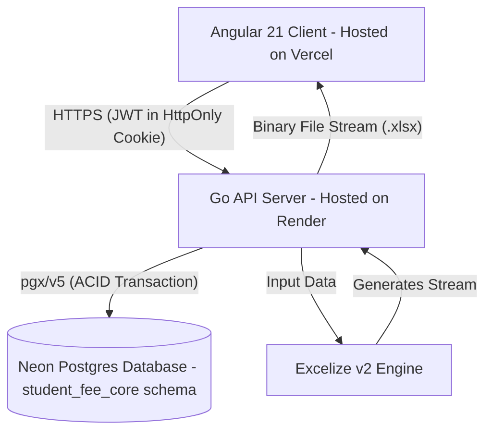

# Student Fee Management System
## Agent Handover & Architecture Specifications (AGENTS.md)

This specification details the technical stack, architecture mapping, and database structure for the Student Fee Management System. It is designed to guide autonomous coding agents in implementing the frontend, backend, and database components.

---

## 1. Technical Stack Directory

### Frontend Client
*   **Framework**: Angular 21 (Zoneless architecture utilizing Signals for reactive forms and state management).
*   **Styling**: Custom CSS/SCSS containing Neumorphic styles. Primary accent: Pastel Baby Blue (`#E1F0FA`).
*   **Hosting**: Vercel (Edge network hosting).

### Backend API Server
*   **Language**: Go 1.22+
*   **Routing**: Standard library `net/http` or lightweight Go router (e.g., `go-chi/chi` or `gin-gonic/gin`).
*   **Excel Engine**: `github.com/xuri/excelize/v2` (for dynamic `.xlsx` processing).
*   **Hosting**: Render (Web Service deployed via a multi-stage Docker build).

### Database Engine
*   **Server**: PostgreSQL 16.
*   **Go Driver**: `github.com/jackc/pgx/v5` (for high-performance PostgreSQL connections).
*   **Schema**: Contained entirely within a dedicated `student_fee_core` application schema.
*   **Hosting**: Neon (Serverless Postgres with native connection pooling).

---

## 2. System Architecture Map



---

## 3. Database Schema Blueprint (`student_fee_core`)

All database entities exist strictly inside the `student_fee_core` schema to isolate tenant data:

```sql
CREATE SCHEMA IF NOT EXISTS student_fee_core;

-- 1. Enums
DO $$ BEGIN
    CREATE TYPE student_fee_core.student_status AS ENUM ('enrolled', 'inactive', 'graduated', 'suspended');
EXCEPTION
    WHEN duplicate_object THEN null;
END $$;

-- 2. Student Table
CREATE TABLE student_fee_core.students (
    id UUID PRIMARY KEY DEFAULT gen_random_uuid(),
    student_id VARCHAR(50) UNIQUE NOT NULL, -- Format e.g., STU-08291
    name VARCHAR(255) NOT NULL,
    phone VARCHAR(20),
    status student_fee_core.student_status DEFAULT 'enrolled' NOT NULL,
    created_at TIMESTAMP WITH TIME ZONE DEFAULT CURRENT_TIMESTAMP,
    updated_at TIMESTAMP WITH TIME ZONE DEFAULT CURRENT_TIMESTAMP
);

-- 2. AttendanceRecord Table
CREATE TABLE student_fee_core.attendance_records (
    id UUID PRIMARY KEY DEFAULT gen_random_uuid(),
    student_id UUID NOT NULL REFERENCES student_fee_core.students(id) ON DELETE CASCADE,
    record_date DATE NOT NULL,
    is_present BOOLEAN NOT NULL DEFAULT TRUE,
    created_at TIMESTAMP WITH TIME ZONE DEFAULT CURRENT_TIMESTAMP,
    CONSTRAINT unique_student_date UNIQUE (student_id, record_date)
);

-- 3. FeeStatement Table (Financial Audits)
CREATE TABLE student_fee_core.fee_statements (
    id UUID PRIMARY KEY DEFAULT gen_random_uuid(),
    student_id UUID NOT NULL REFERENCES student_fee_core.students(id) ON DELETE CASCADE,
    billing_start_date DATE NOT NULL,
    billing_end_date DATE NOT NULL,
    fee_per_session NUMERIC(10, 2) NOT NULL CHECK (fee_per_session >= 0),
    total_days INT NOT NULL CHECK (total_days >= 0),
    total_fee NUMERIC(10, 2) NOT NULL CHECK (total_fee >= 0),
    created_at TIMESTAMP WITH TIME ZONE DEFAULT CURRENT_TIMESTAMP
);
```
